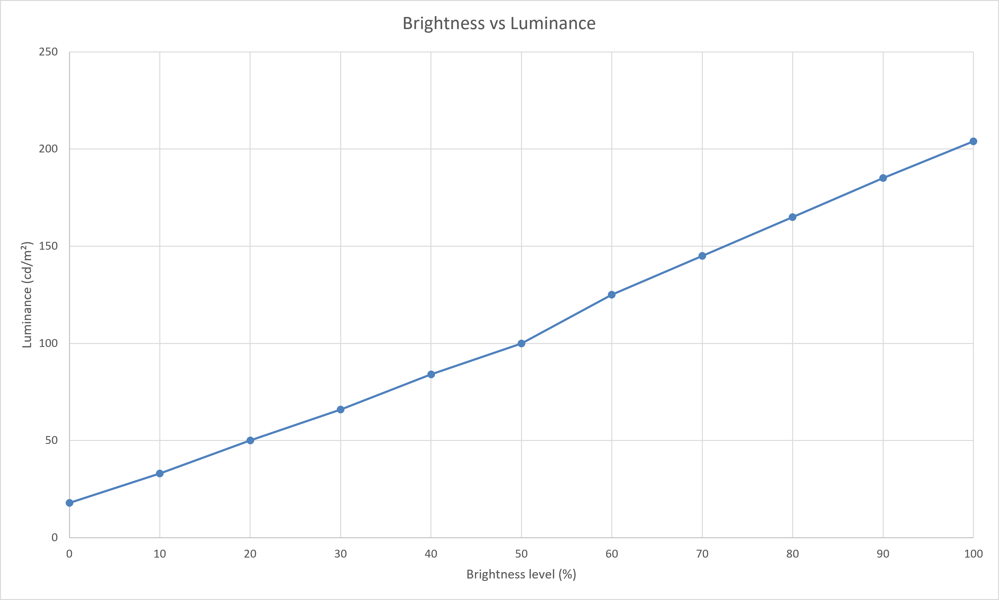

<!-- PAGE_STATUS: OK -->

# Acer Swift SF314-41-R7GB     

14.0-inch 16:9 IPS display with an **LG Philips LP140WFA-SPD1** panel and standard White LED backlight.

Calibration optimized for visual comfort using Spyder X and DisplayCAL.

Official product page: <https://www.acer.com/ru-ru/support/product-support/SF314-41/downloads>

## Table of contents

- [Specifications](#specifications)
  - [Color characteristics](#color-characteristics)
- [Calibration](#calibration)
  - [Environment and targets](#environment-and-targets)
  - [OSD settings](#osd-settings)
- [Downloads](#downloads)
  - [ICC/ICM profile](#iccicm-profile)
  - [Reports](#reports)
- [Brightness response curve](#brightness-response-curve)

## Specifications  

| Parameter          | Value            |
| ------------------ | ---------------- |
| Screen size        | 14.0"            |
| Panel type         | IPS              |
| Aspect ratio       | 16:9             |
| Resolution         | 1920 × 1080      |
| Backlight          | White LED (WLED) |
| Refresh rate       | 60 Hz            |
| Typical brightness | 250 nits         |
| Contrast ratio     | 700:1            |
| Viewing angle(H/V) | 160°(H)/160°(V)  |
| Response time      | ~25 ms           |

### Color characteristics  

**Gamut coverage**
|      Color gamut       | Declared/known coverage | Calibrated and measured coverage |
| :--------------------: | :------------------------: | :---------------------------------: |
| Wide color gamut (WDC) |             -              |                  -                  |
|          sRGB          |           ~ 63%            |               59.63%                |
|          NTSC          |           ~ 45%            |                  -                  |
|         DCI-P3         |           ~ 47%            |               42.29%                |
|       Adobe-RGB        |           ~ 47%            |               41.16%                |
   
**Color depth:** 6 bit    

  <a href="#table-of-contents">⬆ Toc</a>

## Calibration  

Calibration objective: **Visual comfort with reduced eye strain during prolonged use.**  

### Environment and targets

**Calibration environment**
| Parameter        | Value                                 |
| ---------------- | ------------------------------------- |
| Calibration date | 2026-09-08                            |
| Instrument       | Spyder X                              |
| Software         | DisplayCal 3.8.9.3 ArgyllCMS 3.5.0 |

**Calibration target**
| Parameter          | Value              |
| ------------------ | ------------------ |
| Target white point | D65 (6500 K)       |
| Target gamma       | 2.2                |

  <a href="#table-of-contents">⬆ Toc</a>

## Downloads

### ICC/ICM profile
- [ICC profile](https://xdenb43.github.io/display-comfort-configurations/laptops/acer-swift-sf314-41-r7gb/LP140WFA-SPD1_D6500_2.2_F-S_XYZLUT_MTX.icm)

### Reports  
- [Verification report (HTML)](https://xdenb43.github.io/display-comfort-configurations/laptops/acer-swift-sf314-41-r7gb/Measurement_Report_LP140WFA-SPD1.html)
- [Verification report (PDF)](Measurement_Report_LP140WFA-SPD1.pdf)

  <a href="#table-of-contents">⬆ Toc</a>

## Brightness response curve

Post-calibration measurement with [ArgyllCMS/spotread](https://www.argyllcms.com/doc/spotread.html)

> [!NOTE]
> Recommended luminance levels:
>
> - Night: 80–100 cd/m²
> - Evening: 100–120 cd/m²
> - Daylight: 120–140 cd/m²
> - Bright daylight: 140–160 cd/m²

 

| OSD Brightness (%) | Luminance (cd/m²) |
| :----------------: | :---------------: |
|         0          |        18         |
|         10         |        33         |
|         20         |        50         |
|         30         |        66         |
|         40         |        84         |
|      -> 50 <-      |     -> 100 <-     |
|      -> 60 <-      |     -> 125 <-     |
|      -> 70 <-      |     -> 145 <-     |
|         80         |        165        |
|         90         |        185        |
|        100         |        204        |

  <a href="#table-of-contents">⬆ Toc</a>

