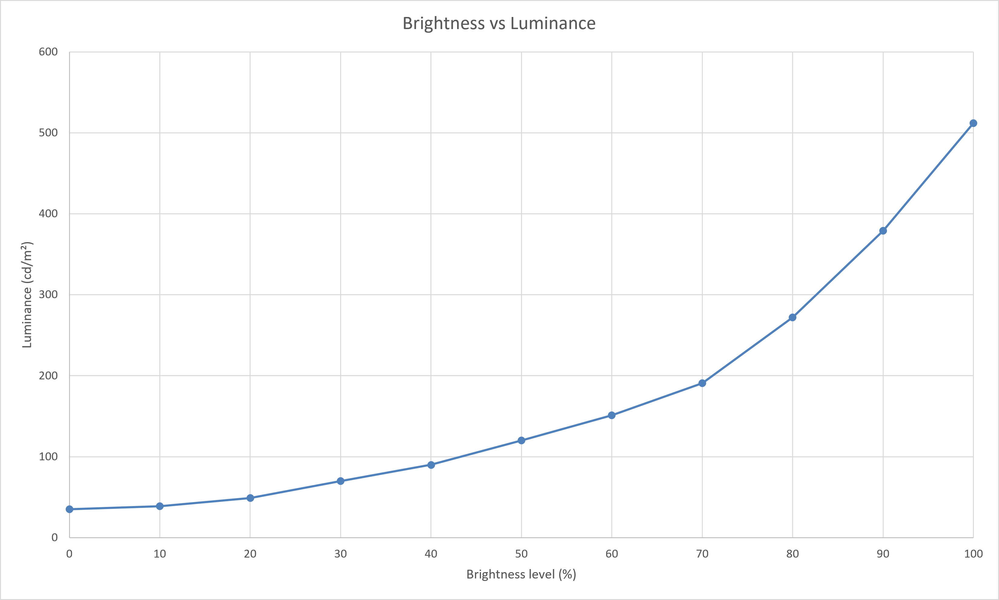

<!-- PAGE_STATUS: OK -->

# Huawei MateView HSN-CBA  

Consumer 28.2-inch IPS **4K+** monitor featuring a LED backlight, 3:2 aspect ratio, 98% DCI-P3 coverage and individual factory colour calibration.

> [!IMPORTANT]
> **Factory calibration:** HUAWEI MateView is individually factory-calibrated by the manufacturer, with a specified colour accuracy of ΔE<2 in DCI-P3 and ΔE<1 in sRGB. 
> Additional calibration is therefore **not required for general use or visual comfort**. 
> The calibration data provided below is optional and intended to further refine colour accuracy and achieve a more precise match to the reference colour space.

Calibration and profiling performed with Spyder X and DisplayCAL, with priority given to visual comfort and verification of the display's actual behaviour.

Official product page: https://consumer.huawei.com/ru/monitors/mateview/

## Table of contents

- [Specifications](#specifications)
  - [Color characteristics](#color-characteristics)
- [Calibration](#calibration)
  - [Environment and targets](#environment-and-targets)
  - [OSD settings](#osd-settings)
- [Downloads](#downloads)
  - [ICC/ICM profile](#iccicm-profile)
  - [Reports](#reports)
- [Brightness response curve](#brightness-response-curve)

## Specifications  

| Parameter           | Value           |
| ------------------- | --------------- |
| Screen size         | 28.2"           |
| Panel type          | IPS             |
| Aspect ratio        | 3:2             |
| Resolution          | 3840 × 2560     |
| Backlight           | LED             |
| Refresh rate        | 60 Hz           |
| Typical brightness  | 500 nits        |
| Contrast ratio      | 1200:1          |
| Viewing angle (H/V) | 178°(H)/178°(V) |
| Response time       | Not specified   |

### Color characteristics  

**Gamut coverage** for default gamma
|      Color gamut       | Declared/known coverage | Calibrated and measured coverage |
| :--------------------: | :------------------------: | :---------------------------------: |
| Wide color gamut (WDC) |     :heavy_check_mark:     |         :heavy_check_mark:          |
|          sRGB          |            100%            |                100%                 |
|          NTSC          |             -              |                  -                  |
|         DCI-P3         |            98%             |               96.06%                |
|       Adobe-RGB        |             -              |               87.98%                |
   
**Color depth:** 10 bit 

  <a href="#table-of-contents">⬆ Toc</a>

## Calibration  

Calibration objective: **Visual comfort with reduced eye strain during prolonged use.**  

### Environment and targets

**Calibration environment**
| Parameter        | Value                                 |
| ---------------- | ------------------------------------- |
| Calibration date | 2026-09-16                            |
| Instrument       | Spyder X                              |
| Software         | DisplayCal 3.8.9.3 ArgyllCMS 3.5.0 |

**Calibration target**
| Parameter          | Value        |
| ------------------ | ------------ |
| Target white point | D65 (6500 K) |
| Target gamma       | 2.2          |
| Target luminance   | 120 cd/m²    |

### OSD settings  

- Display menu:  
    - Gamma: default
    - Brightness: 50  

  <a href="#table-of-contents">⬆ Toc</a>

## Downloads

> [!IMPORTANT]  
> The ICC profile was created using the OSD settings listed above.  
> Different monitor settings (brightness, RGB gain, contrast, etc.) may reduce color accuracy.  

### ICC/ICM profile
- [ICC profile](https://xdenb43.github.io/display-comfort-configurations/monitors/huawei-mateview-hsn-cba/Huawei-MateView-HSN-CBA_120cdm2_D6500_2.2_F-S_XYZLUT_MTX.icm)

### Reports  
- [Verification report (HTML)](https://xdenb43.github.io/display-comfort-configurations/monitors/huawei-mateview-hsn-cba/Measurement_Report_Huawei-MateView-HSN-CBA.html)
- [Verification report (PDF)](Measurement_Report_Huawei-MateView-HSN-CBA.pdf)

  <a href="#table-of-contents">⬆ Toc</a>

## Brightness response curve  

Post-calibration measurement with [ArgyllCMS/spotread](https://www.argyllcms.com/doc/spotread.html) 

> [!NOTE]
> Recommended luminance levels:
>
> - Night: 80–100 cd/m²
> - Evening: 100–120 cd/m²
> - Daylight: 120–140 cd/m²
> - Bright daylight: 140–160 cd/m²

 

| OSD Brightness (%) | Luminance (cd/m²) |
| :----------------: | :---------------: |
|         0          |        35         |
|         10         |        39         |
|         20         |        49         |
|         30         |        70         |
|      -> 35 <-      |     -> 80 <-      |
|      -> 38 <-      |     -> 86 <-      |
|         40         |        90         |
|      -> 44 <-      |     -> 102 <-     |
|      -> 50 <-      |     -> 120 <-     |
|      -> 57 <-      |     -> 141 <-     |
|         60         |        151        |
|         70         |        191        |
|         80         |        272        |
|         90         |        379        |
|        100         |        512        |

  <a href="#table-of-contents">⬆ Toc</a>

